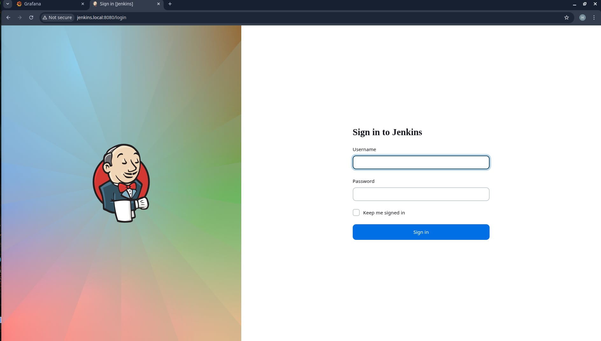
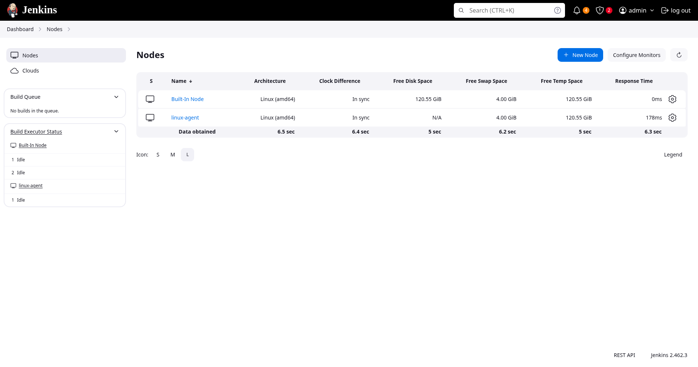
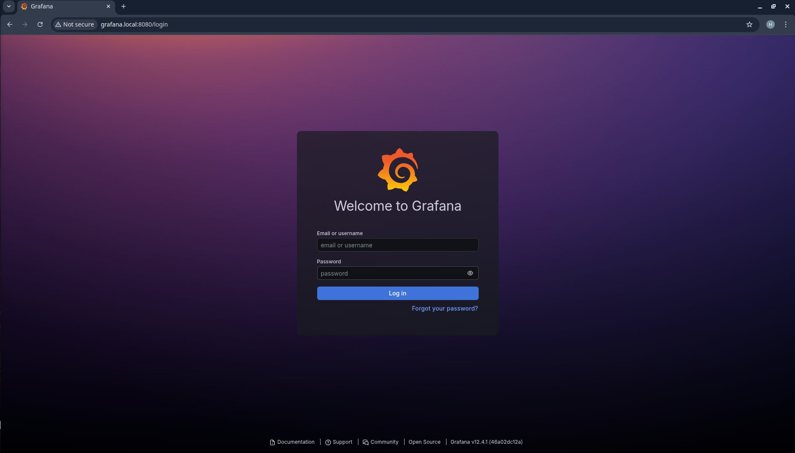

# K8S Infrastructure MVP: Nginx + Postgres + Jenkins + Monitoring

A production-ready Kubernetes infrastructure boilerplate running on **Kind** (Kubernetes in Docker). This project includes a web server, database, automated CI/CD pipeline, and full observability — all accessible via `.local` domains.

---

## System Architecture

- **Frontend/Proxy**: Nginx (3 Replicas) with Ingress Controller — `my-nginx.local`
- **Database**: PostgreSQL with Persistent Volume (PV) and Secrets management.
- **CI/CD**: Jenkins Pipeline (`Jenkinsfile`) — `jenkins.local`
- **Observability**: Prometheus (Data collection) & Grafana (Visualization) — `grafana.local`

---

## Quick Start (Kind Cluster)

```bash
make up
```

This single command creates the Kind cluster (using `kind-config.yaml`), installs the Nginx Ingress Controller, adds `.local` domains to `/etc/hosts`, and deploys all services.

Run `make help` to see all available targets.

---

## Accessing the Services

All services are accessible via Ingress through `.local` domains. If your cluster was created **without** `extraPortMappings` (port 80 not exposed), use the [Port-Forward fallback](#port-forward-fallback-existing-cluster) below.

### Web Application — `my-nginx.local`

Visit: **http://my-nginx.local**

### Jenkins CI/CD — `jenkins.local`

Visit: **http://jenkins.local**

> First-time setup: retrieve the admin password with:
> ```bash
> make jenkins-password
> ```





### Grafana Monitoring — `grafana.local`

Visit: **http://grafana.local**

Default credentials: `admin` / `admin`

> Prometheus data source URL (add in Grafana): `http://prometheus-service.monitoring.svc.cluster.local`



---

## Port-Forward Fallback (Existing Cluster)

If your cluster does **not** have port 80 mapped to the host (i.e. created without `extraPortMappings`), forward the Ingress controller instead:

```bash
make port-forward
```

Then access services on port 8080:
- **http://my-nginx.local:8080**
- **http://jenkins.local:8080**
- **http://grafana.local:8080**

---

## Directory Structure

```text
├── nginx/
│   ├── deployment/   # Nginx Deployment (3 replicas, unprivileged)
│   ├── service/      # ClusterIP Service
│   └── ingress/      # Ingress rule -> my-nginx.local
├── postgresql/       # PV, PVC, Secret, Deployment, Service, NetworkPolicy
├── jenkins/
│   ├── jenkins.yaml  # Deployment + Service
│   ├── jenkins-pvc.yaml
│   └── ingress.yaml  # Ingress rule -> jenkins.local
├── monitoring/
│   ├── prometheus.yaml        # Prometheus Deployment + Service + ConfigMap
│   ├── grafana.yaml           # Grafana Deployment + Service
│   └── grafana-ingress.yaml   # Ingress rule -> grafana.local
├── kind-config.yaml  # Kind cluster config (ports 80/443 exposed)
├── Makefile          # All lifecycle commands (make help)
└── Jenkinsfile       # CI/CD pipeline definition
```

---

## Maintenance & Verification

```bash
make status        # pods, services, ingresses
make watch         # live pod status
make events        # recent K8s events
make logs-nginx    # tail Nginx logs
make logs-jenkins  # tail Jenkins logs
make logs-grafana  # tail Grafana logs
make logs-ingress  # tail Ingress Controller logs
```

---

## Ingress Summary

| Domain | Service | Namespace |
|--------|---------|-----------|
| `my-nginx.local` | `nginx-service:80` | default |
| `jenkins.local` | `jenkins-service:8080` | default |
| `grafana.local` | `grafana-service:80` | monitoring |
